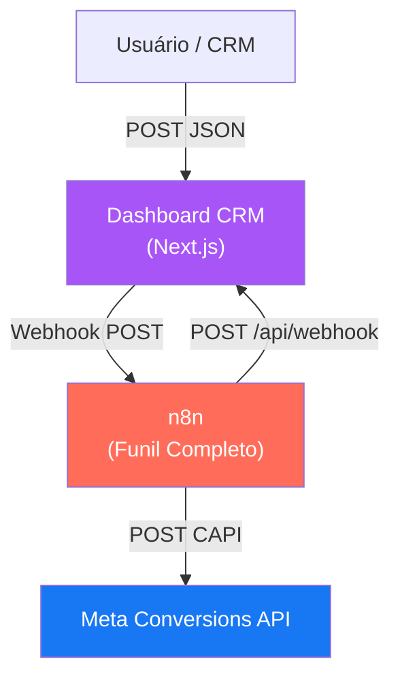

# Dashboard CRM GTech

Aplicação web ultramoderna construída em **React (Next.js)** que serve como painel de controle visual para o funil de vendas da GTech. O dashboard recebe dados em tempo real do [[Funil Completo - Disparo META|workflow n8n]] e exibe os leads em um **quadro Kanban** organizado por etapas do funil.

## Arquitetura



## Funcionalidades

- **Painel Kanban** com 5 colunas: Qualificação, Aquecimento, Reunião, Contrato, Fechado
- **Atualização em tempo real** (polling a cada 5 segundos via `/api/webhook` GET)
- **Logo GTech** gerada por IA

### Painel Admin (Drawer lateral via ícone ⚙️)

- **Seção 1 — Webhooks n8n:** Lista todas as 5 URLs completas de webhook com botão de cópia individual. A URL base do n8n é configurável pelo admin (salva em `localStorage`).
- **Seção 2 — Disparo de Teste:** Formulário para simular leads de teste diretamente para o n8n.

## Design System (UI/UX Pro Max)

| Propriedade | Valor |
|-------------|-------|
| **Estilo** | Dark Mode OLED |
| **Background** | `#020617` |
| **Cards** | `#0F172A` |
| **CTA** | `#22C55E` |
| **Tipografia** | Fira Sans (headings) + Fira Code (dados) |
| **Ícones** | SVG Lucide (sem emojis) |
| **Navbar** | Floating, `backdrop-filter: blur(20px)` |
| **Acessibilidade** | WCAG AAA, `prefers-reduced-motion` |
| **Transições** | 150–350ms cubic-bezier |

## Stack Tecnológica

| Tecnologia | Uso |
|------------|-----|
| **Next.js** (React) | Framework web com App Router |
| **CSS Puro** | Design system UI/UX Pro Max (Dark Mode OLED) |
| **Lucide Icons** | Ícones SVG inline (substituem emojis) |
| **Docker** | Containerização para deploy no Portainer |
| **Node.js API Routes** | Backend para recebimento de webhooks |

## API Route `/api/webhook`

| Método | Descrição |
|--------|-----------|
| `POST` | Recebe dados de um lead e salva no `data.json` local |
| `GET` | Retorna todos os leads armazenados |

### Payload esperado (POST)

```json
{
  "nome": "João da Silva",
  "email": "joao@exemplo.com",
  "telefone": "(11) 99999-9999",
  "valor": 5000,
  "stage": "CRM_Qualificacao"
}
```

## Deploy

O projeto está preparado para deploy via **Docker/Portainer** usando GitHub como fonte:

- **Dockerfile:** Build multi-stage com Node 18 Alpine
- **docker-compose.yml:** Serviço `crm-dashboard` na porta 3000
- **Container name:** `gtech-crm-dashboard`
- **Persistência:** Volume montado em `data.json`

> [!IMPORTANT]
> O nó "Enviar para Dashboard" no n8n usa a URL `http://crm-dashboard:3000/api/webhook`. Isso pressupõe que o container do Dashboard e o n8n estão na **mesma rede Docker**. Se não estiverem, a URL precisará ser ajustada para o domínio público do Dashboard.

## Páginas Relacionadas

- [[Funil Completo - Disparo META]] — Workflow n8n que alimenta o Dashboard
- [[Funil de Vendas]] — Modelo de etapas do funil
- [[Meta (Facebook)]] — Integração final dos eventos
