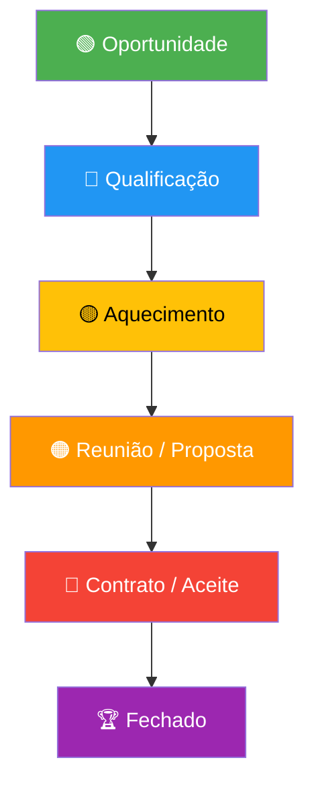

# Funil de Vendas

O funil de vendas utilizado no projeto é um modelo de 6 etapas que rastreia a jornada de um lead desde o primeiro contato até o fechamento do negócio. A primeira etapa (**Oportunidade/Lead**) é rastreada exclusivamente pelo **Pixel do navegador**. As etapas seguintes (Qualificação em diante) são enviadas pelo **CRM via webhook**, com eventos prefixados com `CRM_` para diferenciação no Meta Events Manager.

## Etapas do Funil



## Mapeamento Completo

| # | Etapa do Funil | Evento Meta | Origem | Webhook |
|---|----------------|-------------|--------|---------|
| 1 | **Oportunidade** | `Lead` | 🌐 Pixel (navegador) | _(não usa webhook)_ |
| 2 | **Qualificação** | `CRM_Qualificacao` | 🖥️ CRM | `/gtech/leads/qualificacao` |
| 3 | **Aquecimento** | `CRM_Aquecimento` | 🖥️ CRM | `/gtech/leads/aquecimento` |
| 4 | **Reunião/Proposta** | `CRM_Reuniao` | 🖥️ CRM | `/gtech/leads/reuniao_proposta` |
| 5 | **Contrato/Aceite** | `CRM_Contrato` | 🖥️ CRM | `/gtech/leads/contrato_aceite` |
| 6 | **Fechado** | `Purchase` | 🖥️ CRM | `/gtech/leads/fechado` |

## Dados enviados por etapa

Todas as etapas enviam os mesmos campos:

- **E-mail** do lead (hasheado via [[Hashing PII SHA-256]])
- **Telefone** do lead (hasheado via [[Hashing PII SHA-256]])
- **Valor** do negócio (`custom_data.value`, em BRL)
- **ID do evento** (para deduplicação)
- **Timestamp** da conversão

## Lógica de negócio

O funil pressupõe que o sistema de origem (CRM da GTech) dispare um webhook HTTP POST para o n8n cada vez que um lead muda de etapa. O body esperado contém:

```json
{
  "email": "lead@exemplo.com",
  "telefone": "(11) 99999-9999",
  "valor": 5000,
  "id": "lead-id-123"
}
```

Os campos `telefone`/`phone` e `valor`/`value` são aceitos como alias.

## Páginas Relacionadas

- [[Funil Completo - Disparo META]] — Workflow que implementa o funil
- [[Meta Conversions API]] — API que recebe os eventos
- [[Meta (Facebook)]] — Plataforma de destino
