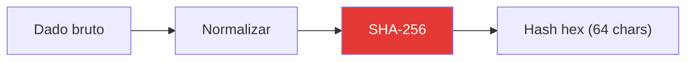

# Hashing PII SHA-256

A [[Meta Conversions API]] exige que dados pessoais identificáveis (PII — Personally Identifiable Information) sejam enviados como hashes SHA-256. Isso garante que os dados brutos do usuário nunca trafeguem em texto claro pela rede, enquanto ainda permitem que a Meta faça o matching com seus usuários internamente.

## Processo de Hash

O fluxo de normalização e hash segue esta sequência:



### Para e-mail (`em`)

1. **Trim:** Remove espaços em branco nas extremidades
2. **Lowercase:** Converte tudo para minúsculas
3. **Hash:** `crypto.createHash('sha256').update(emailLimpo).digest('hex')`

```
"  Lead@Exemplo.COM  " → "lead@exemplo.com" → "a1b2c3d4..."
```

### Para telefone (`ph`)

1. **Remove não-numéricos:** Retira parênteses, hífens, espaços, `+`
2. **Hash:** `crypto.createHash('sha256').update(telefoneLimpo).digest('hex')`

```
"(11) 99999-9999" → "11999999999" → "e5f6g7h8..."
```

## Campos PII suportados pela Meta

| Campo | Descrição | Normalização |
|-------|-----------|-------------|
| `em` | E-mail | trim + lowercase |
| `ph` | Telefone | apenas dígitos |
| `fn` | Primeiro nome | trim + lowercase |
| `ln` | Sobrenome | trim + lowercase |
| `ct` | Cidade | trim + lowercase + sem espaços |
| `st` | Estado | código de 2 letras, lowercase |
| `zp` | CEP | apenas dígitos |
| `country` | País | código ISO de 2 letras, lowercase |

> [!NOTE]
> No projeto atual, apenas `em` (e-mail) e `ph` (telefone) são utilizados. Os demais campos podem ser adicionados futuramente para melhorar a taxa de matching da Meta.

## Implementação no Projeto

No workflow [[Funil Completo - Disparo META]], o hash é implementado em cada nó Code usando o módulo `crypto` nativo do Node.js:

```javascript
const crypto = require('crypto');
const emailLimpo = email.trim().toLowerCase();
const hashEmail = crypto.createHash('sha256').update(emailLimpo).digest('hex');
```

Os dados são enviados no formato:

```json
{
  "user_data": {
    "em": ["hash-do-email"],
    "ph": ["hash-do-telefone"]
  }
}
```

> [!IMPORTANT]
> Os campos `em` e `ph` são **arrays**, mesmo quando contém apenas um valor. Isso é exigido pela [[Meta Conversions API]].

## Tratamento de Dados Ausentes

Se o e-mail ou telefone estiver vazio ou ausente, o campo correspondente é simplesmente omitido do `user_data` (não é enviado como hash de string vazia). Isso evita falsos matches na Meta.

## Páginas Relacionadas

- [[Meta Conversions API]] — API que exige o hashing
- [[Funil Completo - Disparo META]] — Workflow que implementa o hash
- [[Meta (Facebook)]] — Plataforma que consome os dados hasheados
