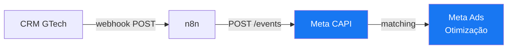

# Meta (Facebook)

Integração com o ecossistema Meta Ads para envio de conversões server-side via [[Meta Conversions API]].

## Dados da Integração

| Item | Valor |
|------|-------|
| **Plataforma** | Meta (Facebook/Instagram Ads) |
| **API utilizada** | Conversions API (CAPI) |
| **API Version** | `v19.0` |
| **Pixel ID** | `1511124637024458` |
| **Autenticação** | Access Token (credencial gerenciada recomendada) |
| **Endpoint base** | `https://graph.facebook.com/v19.0/` |

## Fluxo de Integração

## Workflows que usam esta integração

- [[Funil Completo - Disparo META]] — Envia eventos de 6 etapas do [[Funil de Vendas]]

## Eventos enviados

| Evento | Origem | Descrição | Frequência esperada |
|--------|--------|-----------|---------------------|
| `Lead` | 🌐 Pixel | Nova oportunidade | A cada novo lead (navegador) |
| `CRM_Qualificacao` | 🖥️ CRM | Lead qualificado | Após qualificação |
| `CRM_Aquecimento` | 🖥️ CRM | Lead aquecido | Após engajamento |
| `CRM_Reuniao` | 🖥️ CRM | Reunião agendada | Após agendamento |
| `CRM_Contrato` | 🖥️ CRM | Contrato aceito | Após aceite |
| `Purchase` | 🖥️ CRM | Negócio fechado | Após fechamento |

## Dados pessoais enviados

Todos hasheados com [[Hashing PII SHA-256]]:

- E-mail (`em`)
- Telefone (`ph`)

## Notas de Segurança

> [!WARNING]
> **Token exposto no código-fonte.** O access token da Meta está atualmente embutido diretamente na URL do nó HTTP Request. Recomendações:
> 1. Criar uma credencial do tipo `Header Auth` no n8n
> 2. Mover o token para variável de ambiente do n8n
> 3. Remover o token da query string da URL
> 4. Rotacionar o token atual após a migração

> [!NOTE]
> A API version `v19.0` pode precisar de atualização periódica. A Meta deprecia versões de API a cada ~2 anos. Verifique a [documentação de versionamento da Meta](https://developers.facebook.com/docs/graph-api/changelog/versions/) para conferir a versão atual.

## Páginas Relacionadas

- [[Meta Conversions API]] — Detalhes da API
- [[Funil Completo - Disparo META]] — Workflow principal
- [[Funil de Vendas]] — Modelo de etapas
- [[Hashing PII SHA-256]] — Requisito de privacidade
