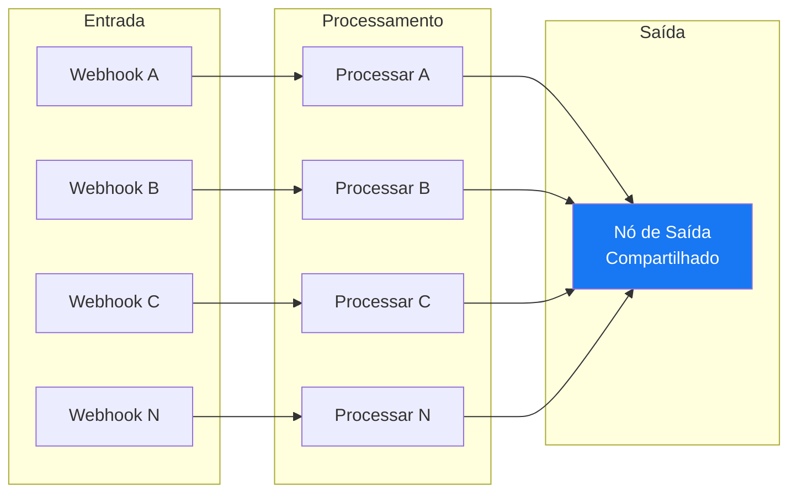

# Webhook Multi-Etapa

Padrão arquitetural recorrente em automações n8n onde múltiplos webhooks paralelos recebem eventos distintos, cada um passa por processamento individual, e todos convergem para um único nó de saída compartilhado.

## Diagrama

## Quando usar

- Vários tipos de evento precisam ser recebidos por endpoints distintos
- Cada evento requer processamento/normalização específica
- Todos os eventos convergem para o mesmo destino (API, banco de dados, notificação)
- Você quer manter um único workflow em vez de N workflows separados

## Vantagens

- **Centralização:** Um único workflow gerencia todos os tipos de evento
- **Visibilidade:** Todas as etapas são visíveis no mesmo canvas do n8n
- **Manutenção:** Mudanças no nó de saída afetam todos os fluxos simultaneamente
- **Monitoramento:** Execuções de todos os tipos de evento aparecem no mesmo histórico

## Desvantagens

- **Acoplamento:** Um erro no nó de saída compartilhado afeta todos os fluxos
- **Complexidade visual:** Com muitas etapas, o canvas pode ficar poluído
- **Timeout:** Se o nó de saída for lento, todos os webhooks ficam esperando

## Variações

### Com nó Merge (alternativa)
Em vez de conectar todos diretamente ao nó de saída, usar um nó **Merge** ou **Switch** intermediário para consolidação.

### Com workflow separado (alternativa)
Usar **Execute Workflow** para delegar o processamento a um sub-workflow compartilhado, mantendo cada webhook em seu próprio workflow.

## Uso no Projeto

No workflow [[Funil Completo - Disparo META]], este padrão é implementado com:
- **5 webhooks** de entrada (etapas CRM do [[Funil de Vendas]], excluindo Lead/Oportunidade que é Pixel-only)
- **5 nós Code** de processamento (normalização + [[Hashing PII SHA-256]], com prefixo `CRM_` nos eventos)
- **1 nó HTTP Request** de saída ([[Meta Conversions API]])

## Páginas Relacionadas

- [[Funil Completo - Disparo META]] — Implementação concreta deste padrão
- [[Funil de Vendas]] — Contexto de negócio das etapas
