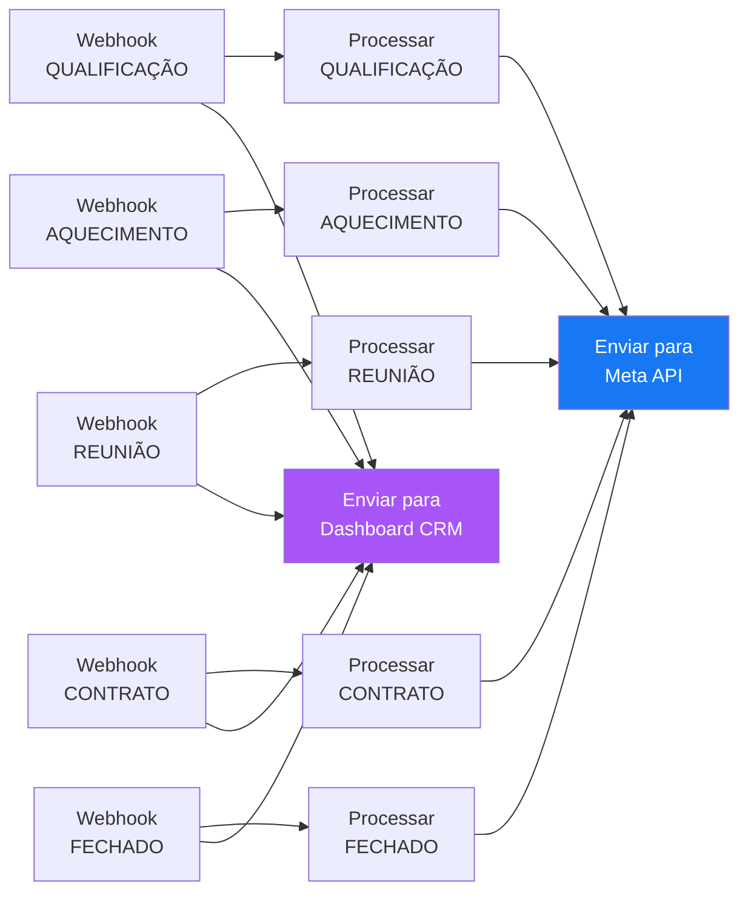

# Funil Completo - Disparo META

Pipeline de conversões offline que captura eventos de cada etapa do [[Funil de Vendas]] via webhooks, aplica [[Hashing PII SHA-256]] nos dados pessoais e envia os eventos para a [[Meta Conversions API]]. Todos os eventos são prefixados com `CRM_` para diferenciar dos eventos do Pixel do navegador.

> [!NOTE]
> O evento **Lead** (Oportunidade) foi removido deste workflow — ele é disparado exclusivamente pelo **Pixel do navegador**. O CRM cobre as etapas de Qualificação em diante.

## Propósito

Integrar o CRM/sistema de leads da GTech com o ecossistema [[Meta (Facebook)]] para otimização de campanhas de anúncio. Cada movimentação de lead no funil gera um evento de conversão server-side, permitindo que o algoritmo do Meta Ads receba sinais reais de qualidade dos leads, mesmo que ocorram fora do navegador.

## Diagrama do Fluxo

## Mapeamento: Funil → Evento Meta

| Etapa do Funil | Evento Meta | Webhook Path | Nó de Processamento |
|----------------|-------------|--------------|---------------------|
| ~~Oportunidade~~ | ~~Lead~~ | _(removido — apenas Pixel)_ | — |
| Qualificação | `CRM_Qualificacao` | `/api/webhooks/gtech/leads/qualificacao` | `ProcessarQualificacao` |
| Aquecimento | `CRM_Aquecimento` | `/api/webhooks/gtech/leads/aquecimento` | `ProcessarAquecimento` |
| Reunião/Proposta | `CRM_Reuniao` | `/api/webhooks/gtech/leads/reuniao_proposta` | `ProcessarReuniao` |
| Contrato/Aceite | `CRM_Contrato` | `/api/webhooks/gtech/leads/contrato_aceite` | `ProcessarContrato` |
| Fechado | `Purchase` | `/api/webhooks/gtech/leads/fechado` | `ProcessarFechado` |

## Detalhes Técnicos

### Webhooks (Entrada)

- **Método:** POST
- **Modo de resposta:** `lastNode` (a resposta da Meta API é retornada ao chamador)
- **Base URL:** `https://n8n.proxserverabner.site/webhook/`
- **Padrão arquitetural:** [[Webhook Multi-Etapa]]

### Processamento (Code Nodes)

Cada nó Code executa a lógica de normalização e enriquecimento de dados de match:

1. Extrai `nome`, `email`, `telefone`/`phone` e `id`/`lead_id` do body, e o IP/User-Agent dos cabeçalhos da requisição HTTP (`user-agent` e `x-forwarded-for`/`x-real-ip`).
2. Limpa o e-mail (`trim().toLowerCase()`).
3. Limpa o telefone (apenas dígitos) e insere automaticamente o prefixo internacional brasileiro (`55`) caso o número tenha 10 ou 11 dígitos e o DDI não esteja presente.
4. Divide o nome completo em primeiro nome (`fn`) e sobrenome (`ln`).
5. Aplica [[Hashing PII SHA-256]] nos dados pessoais (`em`, `ph`, `fn`, `ln`, `external_id`).
6. Monta o payload no formato `data[]` da [[Meta Conversions API]], incluindo os campos de sessão não hasheados (`client_ip_address` e `client_user_agent`).
7. Inclui `event_id` (para deduplicação), `event_time`, `action_source: "website"`, `event_source_url: "https://n8n.proxserverabner.site"` (para evitar bloqueios sob o domínio `invalid.invalid`), e `custom_data` com `currency: "BRL"` e `value`.

### Envio para Meta (HTTP Request)

- **Destino:** [[Meta (Facebook)]] Conversions API
- **Endpoint:** `https://graph.facebook.com/v19.0/{PIXEL_ID}/events`
- **Pixel ID:** `1511124637024458`
- **Método:** POST
- **Content-Type:** `application/json`
- **Body:** `{{ JSON.stringify($json) }}`
- **Opções de Erro:** `onError: 'continueRegularOutput'` (Ativado para evitar que a falta dos tokens reais em ambiente de homologação ou falhas na API do Facebook interrompam a execução do workflow ou retornem erro 500 para o CRM).

> [!NOTE]
> **Segurança:** O access token da Meta foi removido do código-fonte e do repositório Git, sendo substituído por placeholders de segurança. Para o funcionamento real, o usuário deve preencher as variáveis diretamente no painel administrativo do n8n na nuvem.

### Envio para Dashboard CRM (HTTP Request)

- **Destino:** [[Dashboard CRM GTech]] (aplicação React/Next.js)
- **Endpoint:** `http://gtech-crm-dashboard:3000/api/webhook`
- **Método:** POST
- **Content-Type:** `application/json`
- **Body:** Dados brutos do lead (nome, email, telefone, valor, stage)
- **Rede Docker:** Conectado à rede `n8n-server_default` sob o container `gtech-crm-dashboard`
- **Propósito:** Alimentar o painel Kanban com os leads recebidos em tempo real, *antes* da criptografia e envio para a Meta.

## Configurações do Workflow

| Setting | Valor |
|---------|-------|
| Salvar progresso de execução | ✅ |
| Salvar execuções manuais | ✅ |
| Salvar execuções com erro | Todas |
| Salvar execuções com sucesso | Todas |
| Timeout de execução | 3600s |
| Timezone | UTC |

## Páginas Relacionadas

- [[Meta Conversions API]] — API utilizada para envio dos eventos
- [[Funil de Vendas]] — Modelo de etapas e mapeamento
- [[Hashing PII SHA-256]] — Padrão de hash aplicado
- [[Meta (Facebook)]] — Integração externa
- [[Webhook Multi-Etapa]] — Padrão arquitetural utilizado
- [[Dashboard CRM GTech]] — Painel Kanban React que recebe os leads do n8n
